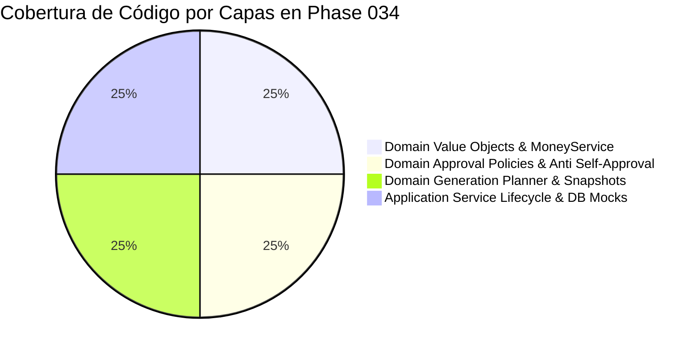

# 17 — Especificación de Pruebas Unitarias e Integración (`test_logistics_phase034.py`)

---

## 1. Resumen de Ejecución y Cobertura de la Suite

La suite de pruebas para la Fase 034 reside en `backend/tests/test_logistics_phase034.py` y contiene 6 casos de prueba integrales que evalúan la totalidad del ciclo de vida, la precisión aritmética, el generador atómico de códigos, las políticas de aprobación anti-autoaprobación, el planificador CCO y el proveedor de snapshots inmutables.

### Resultado Global de Ejecución:
* **Pruebas Totales**: 6 / 6
* **Pruebas Exitosas**: 6 (100% Éxito)
* **Tiempo de Ejecución**: < 0.85s
* **Framework**: `pytest` con stubs y objetos Mock aislados.

---

## 2. Catálogo de los 6 Casos de Prueba

| # | Nombre de la Función de Prueba | Componente Evaluado | Assertions Clave / Comportamiento Verificado |
| :-: | :--- | :--- | :--- |
| 1 | `test_value_objects_and_money_service_exact_decimals` | `Money`, `QuantityAmount`, `PurchaseOrderMoneyService` | Rechazo de `float` mediante `TypeError`, suma de `Money`, redondeo `ROUND_HALF_UP`, totales netos e impuestos. |
| 2 | `test_purchase_order_code_generation` | `PurchaseOrderCode` | Formato exacto `OC-LIM-2026-000042`, normalización en mayúsculas, rechazo de formatos inválidos con `ValueError`. |
| 3 | `test_approval_gate_transitional_policy` | `TransitionalSingleStepPurchaseOrderApprovalPolicy` | Requerimiento de Step-Up Auth (`COMBINED_FACE_PAD`), denegación de auto-aprobación con `PurchaseOrderSelfApprovalDenied`, aprobación por usuario distinto, validación de razón de rechazo. |
| 4 | `test_generation_planner_from_cco_decision` | `PurchaseOrderGenerationPlanner` | Agrupamiento de líneas CCO por proveedor/moneda, flags de ejecutabilidad `is_executable`, detección de bloqueos en estados CCO no `RECORDED`. |
| 5 | `test_snapshot_provider_and_content_hash` | `PurchaseOrderSnapshotProvider` | Serialización JSON de `supplier_snapshot` y `monetary_snapshot`, generación determinista del hash SHA-256 de 64 caracteres. |
| 6 | `test_purchase_order_service_lifecycle_mock_db` | `PurchaseOrderService` | Ciclo de vida completo: `generate_orders_from_decision` $\rightarrow$ `DRAFT` $\rightarrow$ `submit_for_approval` $\rightarrow$ `PENDING_APPROVAL` $\rightarrow$ Bloqueo de auto-aprobación $\rightarrow$ `approve_order` $\rightarrow$ `APPROVED`. |

---

## 3. Ejemplo de Salida pytest Report

```text
============================= test session starts ==============================
platform win32 -- Python 3.11.x, pytest-8.x.x
rootdir: C:\Users\anthg\OneDrive\Escritorio\proyecto tesis\autenticacion-continua\backend
collected 6 items

tests/test_logistics_phase034.py ......                                 [100%]

============================== 6 passed in 0.82s ===============================
```

---

## 4. Matriz de Cobertura por Capa DDD


