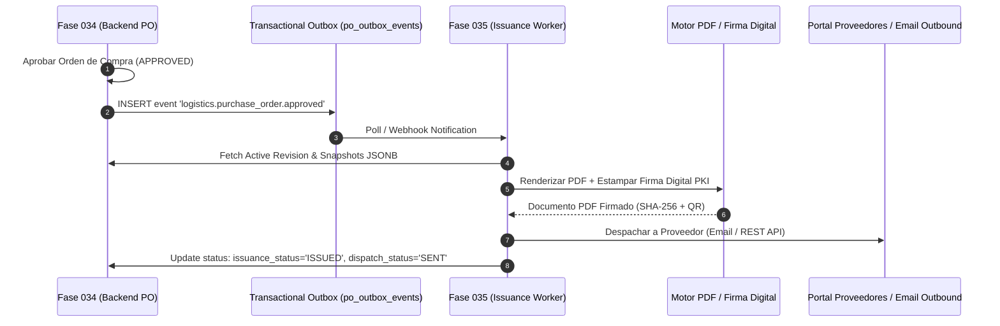

# 18 — Contrato de Integración Downstream con Fase 035 (Emisión y Notificación)

---

## 1. Visión General del Contrato de Transición (Fase 034 $\rightarrow$ Fase 035)

La **Fase 034** concluye con la Orden de Compra formalmente aprobada en estado interno `status = 'APPROVED'` y `approval_status = 'APPROVED'`.

La **Fase 035 — Emisión, Firma Digital y Notificación a Proveedores** actúa como el consumidor downstream primario de este agregador, asumiendo la responsabilidad de convertir la orden aprobada en un documento legal ejecutable para el proveedor.



---

## 2. Componentes Clave de la Fase 035

### 2.1. Motor de Generación PDF y Código QR
* Renderiza la plantilla oficial de Orden de Compra utilizando los snapshots inmutables (`supplier_snapshot`, `buyer_snapshot`, `monetary_snapshot`) garantizando que el PDF refleje exactamente los datos del `content_hash`.
* Estampa un código QR en el pie de página con el enlace de verificación pública y la firma hash SHA-256.

### 2.2. Firma Digital PKI / X.509
* Aplica una firma electrónica avanzada o cualificada sobre el PDF utilizando la clave privada de la empresa emisora.
* Registra el estampado de tiempo de la firma (`Timestamp Authority - TSA`).

### 2.3. Patrón Transactional Outbox (`po_outbox_events`)
Para prevenir fallos en el envío de notificaciones por cortes de red, la Fase 034 escribe el evento de aprobación en una tabla transactional outbox dentro de la misma transacción de la base de datos:

```sql
CREATE TABLE po_outbox_events (
    id UUID PRIMARY KEY DEFAULT gen_random_uuid(),
    aggregate_type VARCHAR(64) NOT NULL DEFAULT 'PurchaseOrder',
    aggregate_id UUID NOT NULL,
    event_type VARCHAR(128) NOT NULL,
    payload JSONB NOT NULL,
    status VARCHAR(32) NOT NULL DEFAULT 'PENDING', -- 'PENDING', 'PROCESSED', 'FAILED'
    created_at TIMESTAMPTZ NOT NULL DEFAULT NOW(),
    processed_at TIMESTAMPTZ
);
```

### 2.4. Flujo de Confirmación del Proveedor (`Acknowledgement`)
La Fase 035 actualizará los campos de seguimiento en `po_purchase_orders`:

* **`issuance_status`**: Cambia de `NOT_ISSUED` a `ISSUED`.
* **`dispatch_status`**: Cambia de `NOT_SENT` a `SENT`.
* **`acknowledgement_status`**: Cambia a `ACCEPTED` cuando el proveedor confirma la recepción en el portal, o `DISPUTED` si solicita cambios comerciales.

---

## 3. Garantías de Consistencia entre Fases

1. **Inmutabilidad Absoluta**: La Fase 035 lee exclusivamente los datos de la revisión aprobada (`approved_revision_id`). No permite edición de montos o ítems durante la generación del PDF.
2. **Idempotencia**: Si el worker de la Fase 035 procesa el mismo evento de outbox múltiples veces, la generación de PDF y el despacho deben ser idempotentes basados en el `content_hash`.
