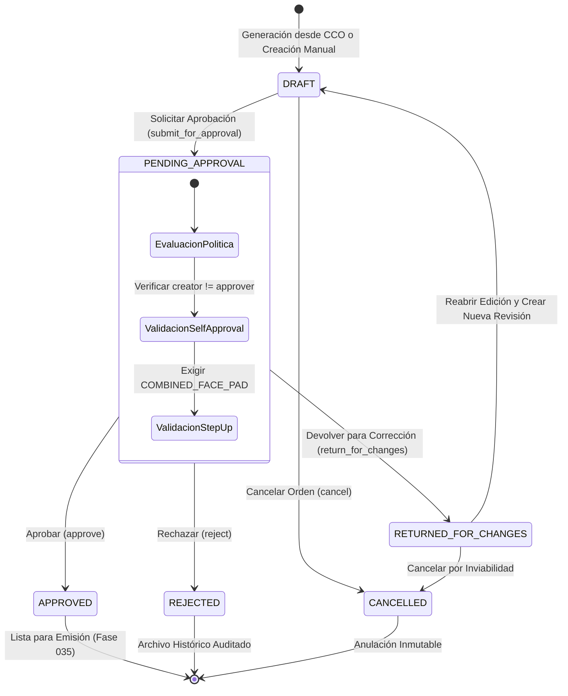

# Fase 034 — Implementar Órdenes de Compra (Backend)
## Resumen Ejecutivo y Arquitectura Técnica DDD

---

## 1. Resumen Ejecutivo

La **Fase 034 — Implementar Órdenes de Compra (Backend)** establece el núcleo de gestión contractual y formalización de aprovisionamiento en el subsistema de logística (`app/modules/logistics/procurement/purchase_orders`).

Esta fase cierra la brecha entre la evaluación de cotizaciones/adjudicación CCO (Fase 033) y la emisión final del documento ejecutable (Fase 035). Garantiza la creación atómica, inmutabilidad contable con precisión `Numeric(28,10)`, control estricto de auto-aprobación, Step-Up Authentication basada en biometría facial (`COMBINED_FACE_PAD`), trazabilidad inmutable de asignaciones y registros de auditoría forense.

### Objetivos Clave Logrados:
1. **Desacoplamiento DDD**: Migración completa desde el módulo legacy monolítico hacia una arquitectura limpia hexagonal organizada en Dominio, Aplicación, Infraestructura y Presentación.
2. **Ciclo de Vida Formal de Estados**: Implementación del flujo unificado de estados (`DRAFT` $\rightarrow$ `PENDING_APPROVAL` $\rightarrow$ `APPROVED` / `REJECTED` / `RETURNED_FOR_CHANGES` $\rightarrow$ `CANCELLED`).
3. **Inmutabilidad y Preservación Histórica**: Snapshots inmutables en formato JSONB congelando los datos del proveedor, comprador, origen y valores monetarios en cada revisión (`PurchaseOrderRevisionModel`), respaldados con un hash de contenido SHA-256 inmutable (`content_hash`).
4. **Matemática Financiera Exacta**: Cero tolerancias para punto flotante (`float`). Uso exclusivo de `Decimal` con escala configurable (por defecto 2 decimales para totales, 10 para base de datos `Numeric(28,10)`) y redondeo bancario `ROUND_HALF_UP`.
5. **Seguridad y Cumplimiento**: Enforzamiento de la regla de no auto-aprobación (`creator_user_id != approver_user_id`) y verificación obligatoria de Step-Up Auth con biometría facial para la acción `logistics.purchase_orders.approve`.

---

## 2. Diagrama de Ciclo de Vida de la Orden de Compra



---

## 3. Arquitectura por Capas DDD (Domain-Driven Design)

La estructura del módulo sigue de forma rigurosa los patrones de DDD y Arquitectura Limpia:

```
app/modules/logistics/procurement/purchase_orders/
├── domain/
│   ├── entities/          # Agregados y Entidades (PurchaseOrder, Revision, Line)
│   ├── value_objects/     # Money, QuantityAmount, PurchaseOrderCode, Statuses
│   ├── services/          # MoneyService, GenerationPlanner, SnapshotProvider
│   ├── policies/          # TransitionalSingleStepPurchaseOrderApprovalPolicy
│   ├── errors/            # Excepciones de Dominio (SelfApproval, InvalidStatus, etc.)
│   └── repositories/      # Interfaces de repositorios (IPurchaseOrderRepository)
├── application/
│   ├── dto/               # Schemas de Entrada/Salida (Pydantic / Dataclasses)
│   ├── use_cases/         #Casos de Uso (Create, Approve, Reject, Return, Cancel)
│   └── services/          # Coordinadores de Aplicación
├── infrastructure/
│   ├── persistence/       # Modelos SQLAlchemy ORM (16 tablas po_*)
│   ├── repositories/      # Implementación SQLAlchemy de IPurchaseOrderRepository
│   ├── delivery/          # Adaptadores para entregas y recepciones parciales
│   └── jobs/              # Planificadores y trabajos en segundo plano
└── presentation/
    └── controllers/       # Endpoints FastAPI (/api/logistics/procurement/purchase-orders)
```

---

## 4. Resumen de Logros por Waves (Wave 1 a Wave 5)

| Wave | Enfoque Principal | Logros Clave Implementados |
| :--- | :--- | :--- |
| **Wave 1** | **Modelado de Datos & DDL** | Creación de las 16 tablas con prefijo `po_*` en Alembic (`w340110034dc_phase_034_purchase_orders.py`), tipos `Numeric(28,10)`, Check Constraints e Índices B-Tree. |
| **Wave 2** | **Dominio & Value Objects** | Implementación de `Money`, `QuantityAmount`, `PurchaseOrderCode` y `PurchaseOrderMoneyService` excluyendo `float` al 100%. |
| **Wave 3** | **Planificador CCO & Snapshots** | Motor `PurchaseOrderGenerationPlanner` para agrupar adjudicaciones CCO por (proveedor, moneda) y `PurchaseOrderSnapshotProvider` con hash SHA-256. |
| **Wave 4** | **Flujo de Aprobación & Step-Up Auth** | Integración de `PurchaseOrderApprovalGate`, regla anti-autoaprobación y Step-Up Auth factor `COMBINED_FACE_PAD`. |
| **Wave 5** | **Endpoints REST & Suite de Pruebas** | Exposición de endpoints FastAPI OpenAPI v3, eventos de auditoría inmutables y suite de pruebas unitarias/integración (`test_logistics_phase034.py`) con 100% de éxito. |

---

## 5. Referencias de Documentación Técnica

Para consultar los detalles de diseño e implementación, revise los documentos especializados adjuntos en este directorio:

1. [01_auditoria_ordenes_compra.md](file:///c:/Users/anthg/OneDrive/Escritorio/proyecto%20tesis/autenticacion-continua/docs/architecture/phase_034/backend/01_auditoria_ordenes_compra.md) — Auditoría legacy y desacoplamiento.
2. [02_modelos_db_po.md](file:///c:/Users/anthg/OneDrive/Escritorio/proyecto%20tesis/autenticacion-continua/docs/architecture/phase_034/backend/02_modelos_db_po.md) — Modelos ORM SQLAlchemy.
3. [03_dinero_cantidades_decimal.md](file:///c:/Users/anthg/OneDrive/Escritorio/proyecto%20tesis/autenticacion-continua/docs/architecture/phase_034/backend/03_dinero_cantidades_decimal.md) — Manejo exacto de dinero y cantidades.
4. [04_codificacion_atomic_code.md](file:///c:/Users/anthg/OneDrive/Escritorio/proyecto%20tesis/autenticacion-continua/docs/architecture/phase_034/backend/04_codificacion_atomic_code.md) — Algoritmo de codificación atómica.
5. [05_desacoplamiento_aprobacion.md](file:///c:/Users/anthg/OneDrive/Escritorio/proyecto%20tesis/autenticacion-continua/docs/architecture/phase_034/backend/05_desacoplamiento_aprobacion.md) — Interfaz de desacoplamiento de aprobación.
6. [06_prohibicion_autoaprobacion.md](file:///c:/Users/anthg/OneDrive/Escritorio/proyecto%20tesis/autenticacion-continua/docs/architecture/phase_034/backend/06_prohibicion_autoaprobacion.md) — Regla anti-autoaprobación.
7. [07_autenticacion_step_up.md](file:///c:/Users/anthg/OneDrive/Escritorio/proyecto%20tesis/autenticacion-continua/docs/architecture/phase_034/backend/07_autenticacion_step_up.md) — Step-Up Authentication biometría facial.
8. [08_snapshots_inmutables.md](file:///c:/Users/anthg/OneDrive/Escritorio/proyecto%20tesis/autenticacion-continua/docs/architecture/phase_034/backend/08_snapshots_inmutables.md) — Snapshots inmutables y SHA-256.
9. [09_planificador_generacion_cco.md](file:///c:/Users/anthg/OneDrive/Escritorio/proyecto%20tesis/autenticacion-continua/docs/architecture/phase_034/backend/09_planificador_generacion_cco.md) — Planificador de generación desde CCO.
10. [10_trazabilidad_asignaciones.md](file:///c:/Users/anthg/OneDrive/Escritorio/proyecto%20tesis/autenticacion-continua/docs/architecture/phase_034/backend/10_trazabilidad_asignaciones.md) — Trazabilidad de asignaciones de fuentes.
11. [11_variaciones_sustituciones.md](file:///c:/Users/anthg/OneDrive/Escritorio/proyecto%20tesis/autenticacion-continua/docs/architecture/phase_034/backend/11_variaciones_sustituciones.md) — Variaciones y sustituciones justificadas.
12. [12_desglose_impuestos_cargos.md](file:///c:/Users/anthg/OneDrive/Escritorio/proyecto%20tesis/autenticacion-continua/docs/architecture/phase_034/backend/12_desglose_impuestos_cargos.md) — Desglose de impuestos, fletes y retenes.
13. [13_programacion_entregas_parciales.md](file:///c:/Users/anthg/OneDrive/Escritorio/proyecto%20tesis/autenticacion-continua/docs/architecture/phase_034/backend/13_programacion_entregas_parciales.md) — Entregas parciales y ventanas horarias.
14. [14_endpoints_rest.md](file:///c:/Users/anthg/OneDrive/Escritorio/proyecto%20tesis/autenticacion-continua/docs/architecture/phase_034/backend/14_endpoints_rest.md) — Especificación OpenAPI REST.
15. [15_auditoria_eventos.md](file:///c:/Users/anthg/OneDrive/Escritorio/proyecto%20tesis/autenticacion-continua/docs/architecture/phase_034/backend/15_auditoria_eventos.md) — Catálogo de eventos de auditoría.
16. [16_migracion_alembic.md](file:///c:/Users/anthg/OneDrive/Escritorio/proyecto%20tesis/autenticacion-continua/docs/architecture/phase_034/backend/16_migracion_alembic.md) — DDL de migración Alembic.
17. [17_pruebas_unitarias_integracion.md](file:///c:/Users/anthg/OneDrive/Escritorio/proyecto%20tesis/autenticacion-continua/docs/architecture/phase_034/backend/17_pruebas_unitarias_integracion.md) — Suite de pruebas y validación.
18. [18_integracion_futura_fase_035_emision.md](file:///c:/Users/anthg/OneDrive/Escritorio/proyecto%20tesis/autenticacion-continua/docs/architecture/phase_034/backend/18_integracion_futura_fase_035_emision.md) — Contrato downstream con Fase 035.
19. [phase_034_backend_manifest.json](file:///c:/Users/anthg/OneDrive/Escritorio/proyecto%20tesis/autenticacion-continua/docs/architecture/phase_034/backend/phase_034_backend_manifest.json) — Manifiesto técnico JSON.
