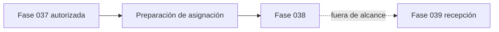

# 01. Auditoría de muelles y descarga

No existía un módulo real de muelles o descarga. La Fase 037 solo exponía `DockAssignmentPreparationService` como lectura y no asignaba muelle. Los directorios documentales de Fases 036 y 037 no estaban presentes; por ello esta auditoría se apoya en código, OpenAPI y migraciones efectivas.

Se conservaron componentes legacy no probados como muertos; solo se corrigió el registro ORM para usar los modelos DDD efectivos.

