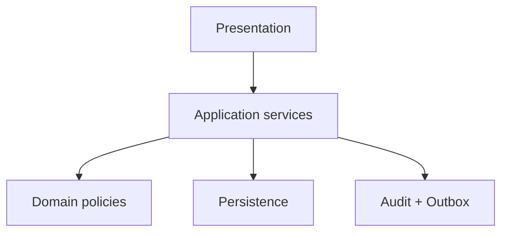

# 02. Arquitectura de dock operations

El módulo sigue DDD por capas: dominio (enums, políticas y métricas), aplicación (servicios), infraestructura (persistencia/jobs) y presentación (FastAPI/Pydantic).

La transacción abarca cambio de estado, evento, auditoría, outbox e idempotencia.

