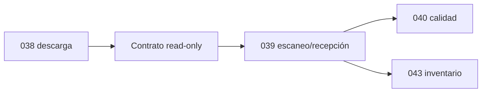

# 03. Límites con Fases 039, 040 y 043

Fase 038 termina al completar descarga y liberar muelle. Solo entrega datos esperados y contexto; no recibe cantidades, no decide aceptación y no mueve existencias.

