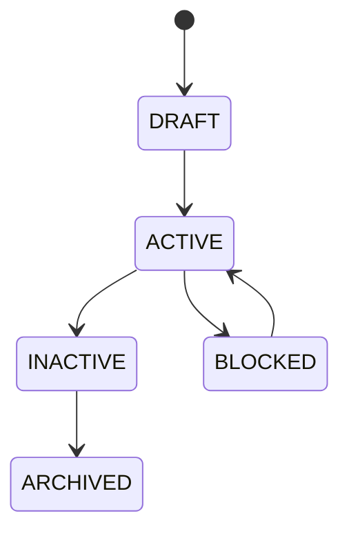

# 04. Maestro de muelles

El maestro identifica organización, sede, almacén, código normalizado, zona, dirección INBOUND/MIXED, zona horaria IANA, dimensiones, peso y capacidad simultánea.

Inactivar o archivar con asignaciones activas se rechaza.

