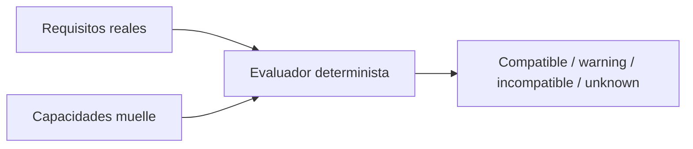

# 05. Capacidades y restricciones

Las banderas tipadas cubren refrigeración, temperatura, peligrosos declarados, sobredimensionados, alto valor, nivelador, shelter y espacio de inspección. Las capacidades extensibles conservan código, tipo y valor JSON validado.

Información ausente produce `UNKNOWN`; nunca se completa con supuestos.

