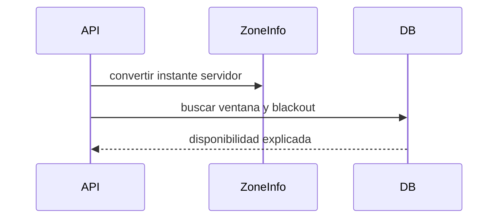

# 06. Horarios y blackouts

Las ventanas usan día, hora local y vigencia; el cálculo convierte el reloj UTC del servidor mediante `zoneinfo`. Los blackouts usan instantes con zona y pueden provocar `REASSIGNMENT_REQUIRED` antes de descargar.

