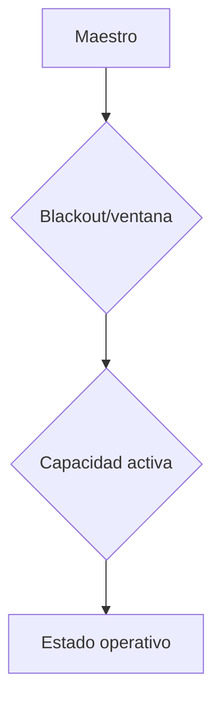

# 07. Estado operativo

El estado derivado distingue disponible, reservado, ocupado, bloqueado, mantenimiento, inactivo y desconocido. Se calcula; no se persiste como verdad mutable.

`UNKNOWN` se devuelve cuando falta una ventana operativa, evitando una falsa disponibilidad.

