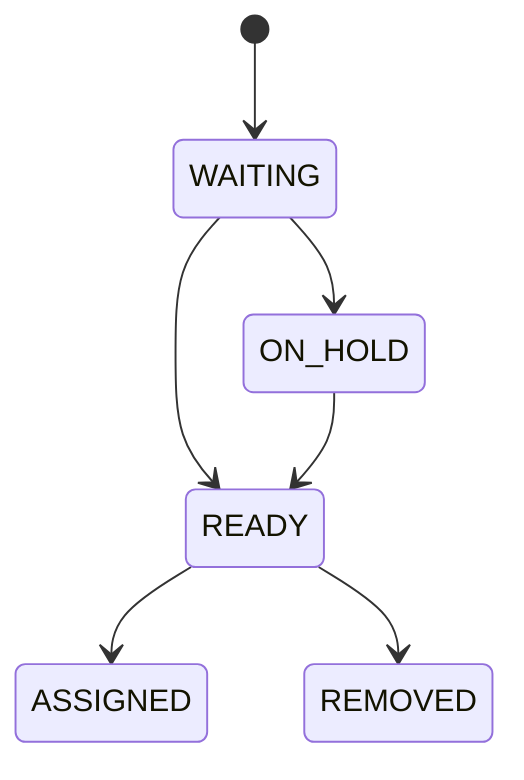

# 08. Cola inbound

La cola nace únicamente desde un Gate Check-In con `entry_authorized_at` y placa observada. Conserva snapshots de vehículo, proveedor y transportista, pero no copia datos sensibles innecesarios.

Un índice parcial impide dos entradas activas para el mismo Gate Check-In.

