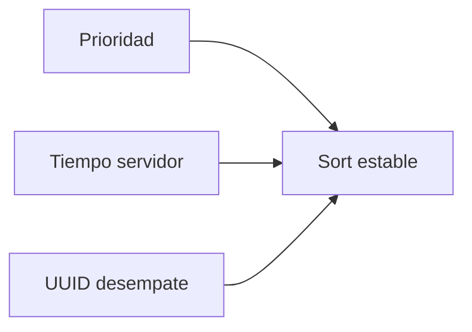

# 09. Orden y prioridad

El orden es determinista: peso de prioridad, instante listo/encolado y UUID como desempate. Cambiar prioridad exige versión optimista y motivo.

Los niveles urgentes requieren justificación desde el contrato Pydantic.

