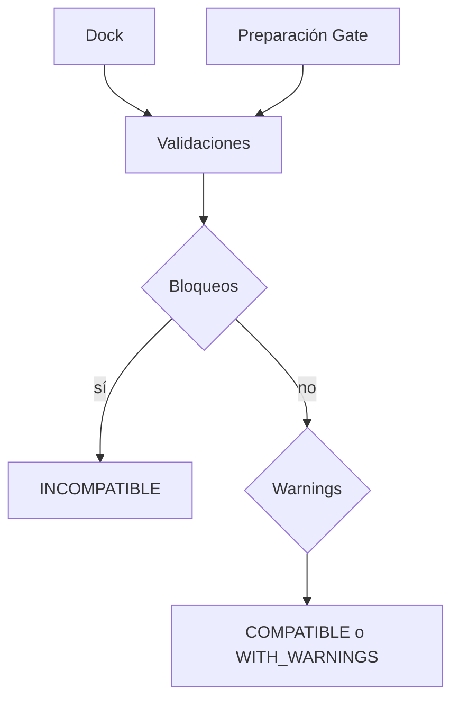

# 10. Compatibilidad

Compatibilidad evalúa dirección, maestro activo, horario, blackout, cupo, dimensiones/peso conocidos y capacidades requeridas.

```mermaid
flowchart TD
  D["Dock"] --> V["Validaciones"]
  G["Preparación Gate"] --> V
  V --> B{"Bloqueos"}
  B -->|sí| N["INCOMPATIBLE"]
  B -->|no| W{"Warnings"}
  W --> C["COMPATIBLE o WITH_WARNINGS"]
```

No se infiere distancia ni se consulta IA.

