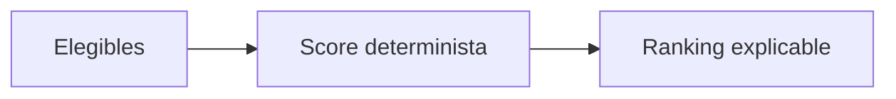

# 11. Recomendación

La recomendación ordena resultados elegibles por score determinista, advertencias, ocupación y código estable. Incluye explicación legible.

`POLICY_AUTOMATIC` permanece desactivado por defecto: una recomendación no confirma una asignación.

