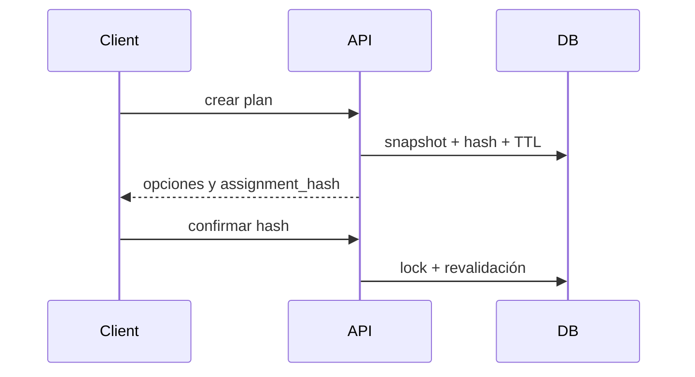

# 12. Plan de asignación

El plan persiste muelles elegibles, incompatibilidades, warnings, intervalo, capacidades, prioridad, hash y expiración.

Un plan vencido o cuyo estado cambió se rechaza con conflicto.

