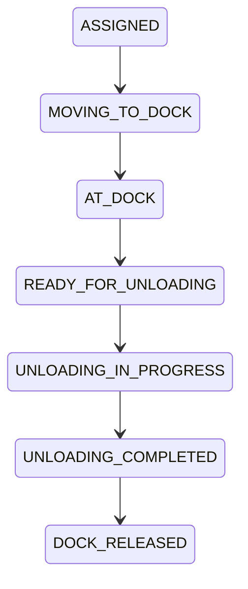

# 13. Asignación

La confirmación crea una asignación con slot de capacidad, snapshots, actor autenticado y hora de servidor; la cola pasa a `ASSIGNED` en la misma transacción.

```mermaid
stateDiagram-v2
  ASSIGNED --> MOVING_TO_DOCK
  MOVING_TO_DOCK --> AT_DOCK
  AT_DOCK --> READY_FOR_UNLOADING
  READY_FOR_UNLOADING --> UNLOADING_IN_PROGRESS
  UNLOADING_IN_PROGRESS --> UNLOADING_COMPLETED
  UNLOADING_COMPLETED --> DOCK_RELEASED
```

