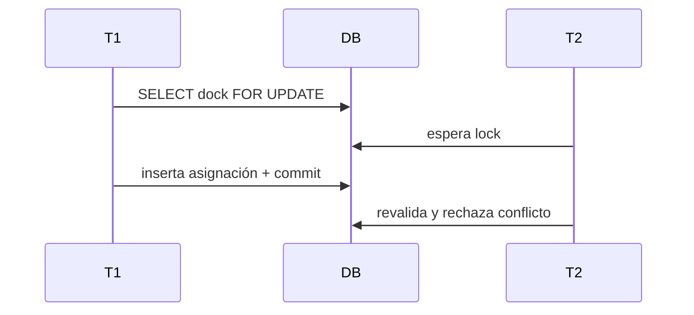

# 14. Solapamientos y concurrencia

La ejecución bloquea plan, cola, muelle y asignaciones activas. Índices parciales protegen Gate Check-In, vehículo, dock/slot, ocupación, operación y pausa.

La defensa principal funciona sin extensiones. Una exclusión GiST de rangos queda pendiente de aprobación DBA.

