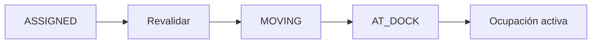

# 15. Movimiento y llegada al muelle

Al iniciar movimiento se revalida Gate autorizado, maestro activo, blackout y ventana. La llegada crea el intervalo de ocupación activo con hora del servidor.

El cliente no puede enviar `movement_started_at` ni `dock_arrived_at`.

