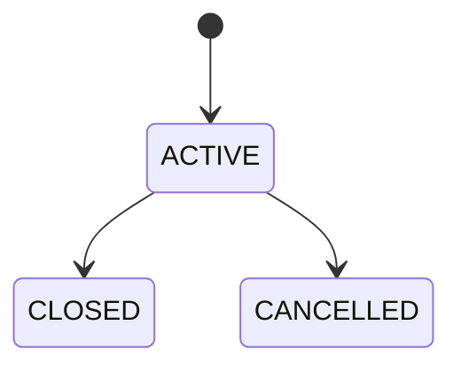

# 16. Ocupación

Una ocupación une muelle, slot, asignación y vehículo desde llegada hasta liberación/cancelación.

```mermaid
stateDiagram-v2
  [*] --> ACTIVE
  ACTIVE --> CLOSED
  ACTIVE --> CANCELLED
```

La liberación exige ocupación activa y un instante no anterior a la llegada.

