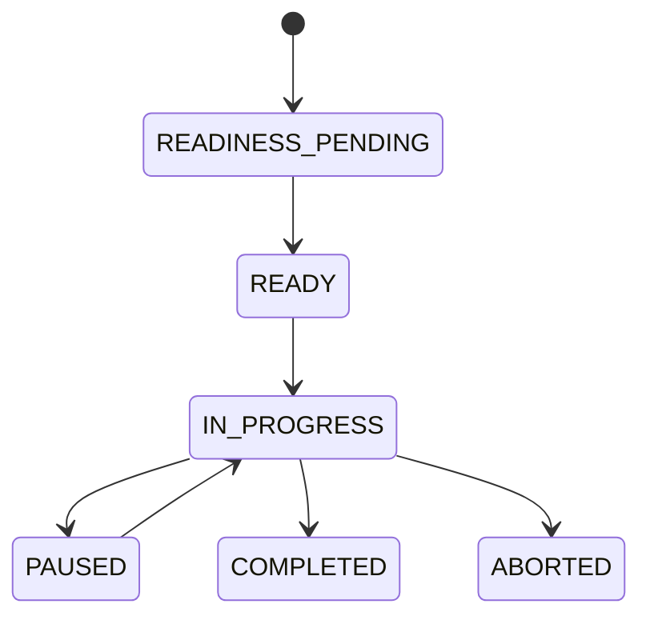

# 17. Modelo de descarga

La operación referencia asignación, Gate Check-In y aviso/cita, conserva resumen de carga esperada y requisitos especiales, pero no contiene campos de recepción.

```mermaid
stateDiagram-v2
  [*] --> READINESS_PENDING
  READINESS_PENDING --> READY
  READY --> IN_PROGRESS
  IN_PROGRESS --> PAUSED
  PAUSED --> IN_PROGRESS
  IN_PROGRESS --> COMPLETED
  IN_PROGRESS --> ABORTED
```

