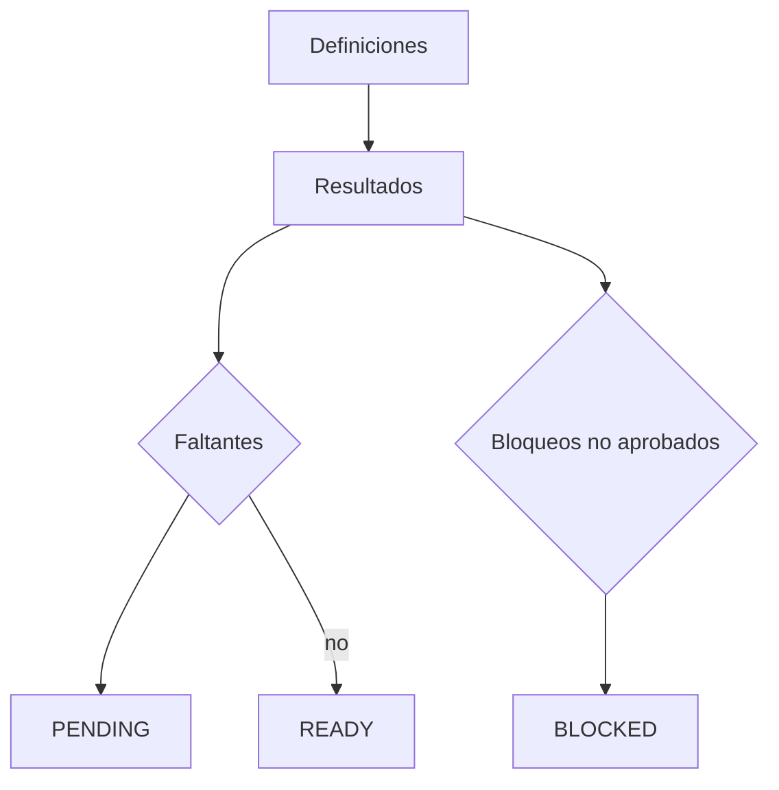

# 18. Readiness

Las definiciones son configurables por organización/muelle y los resultados son inmutables. Checks de Gate, vehículo en dock y dock operativo se derivan del backend; el resto exige registro explícito.

