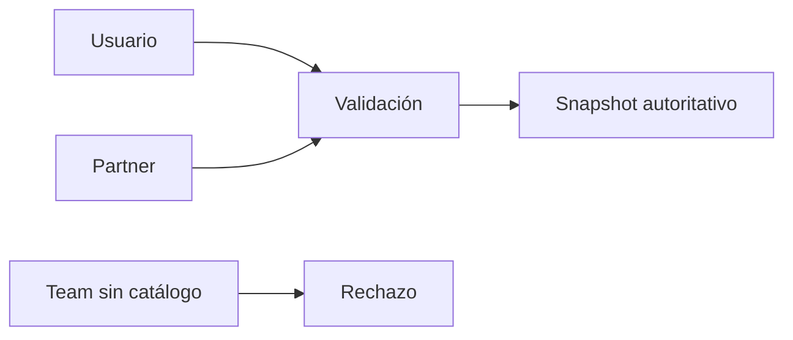

# 19. Responsables

Se validan usuarios activos y contratistas activos. No se acepta una referencia de equipo porque no existe catálogo aprobado; se devuelve un error estable en lugar de inventarlo.

Inicio requiere `DOCK_SUPERVISOR` y `UNLOADING_LEAD` activos.

