# Fase 039 — Backend de recepción por escaneo

Implementación backend-only. No crea stock, kardex, cuarentena, putaway, lotes o series maestros ni actas de diferencia. La migración queda preparada y no se ejecuta en producción.

## Invariantes

- Decimal y Numeric para cantidades; nunca float.
- Actor y reloj proceden del servidor.
- Eventos append-only con compensación.
- Resolución exacta y tenant-scoped; nunca crea productos.

### 1. Descarga a recepción

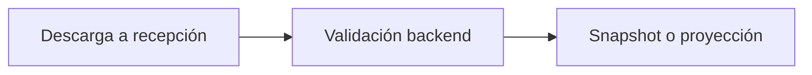

### 2. Fuente a líneas

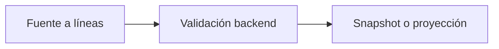

### 3. Sesión a evento

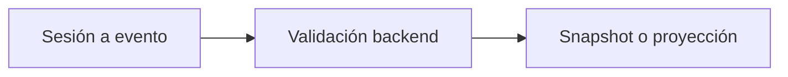

### 4. Código a producto

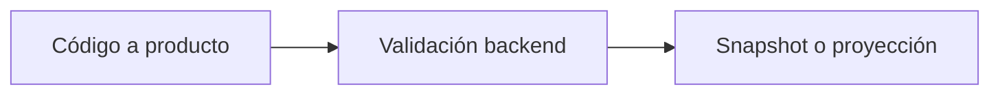

### 5. Escaneo unitario

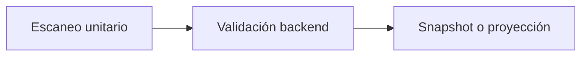

### 6. Escaneo por cantidad

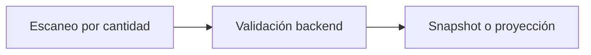

### 7. Escaneo de empaque

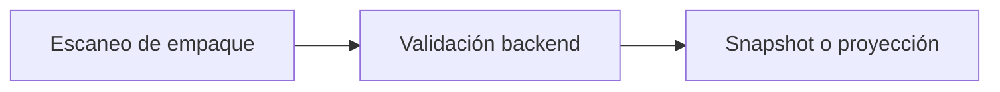

### 8. Captura de lote

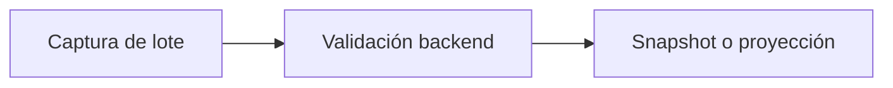

### 9. Captura de serie

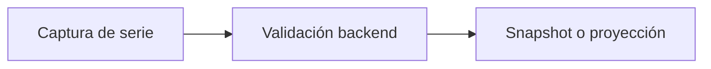

### 10. Captura de vencimiento

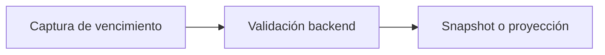

### 11. Comparación

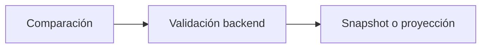

### 12. Compensación

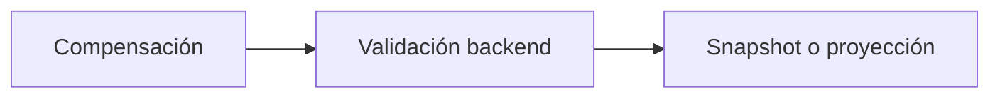

### 13. Recepción parcial

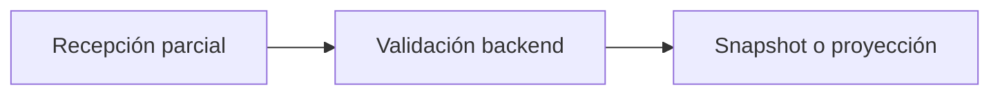

### 14. Recepción total

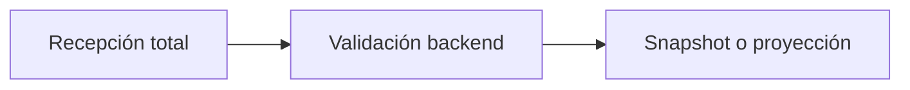

### 15. Candidato

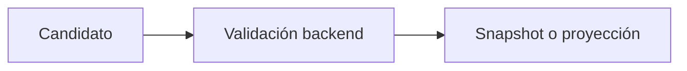

### 16. Snapshot

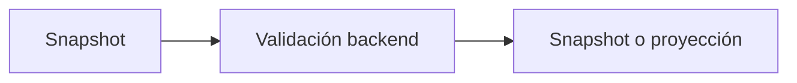

### 17. Handoff 040

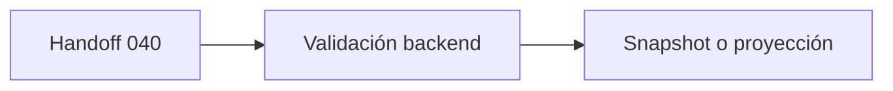

### 18. Handoff 046

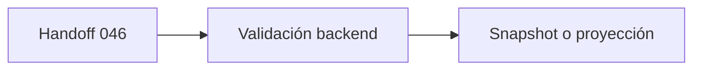

### 19. Límite inventario

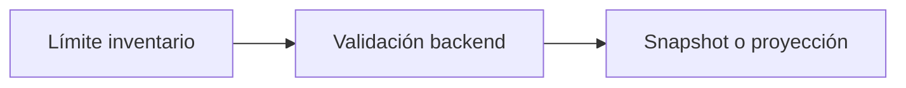

