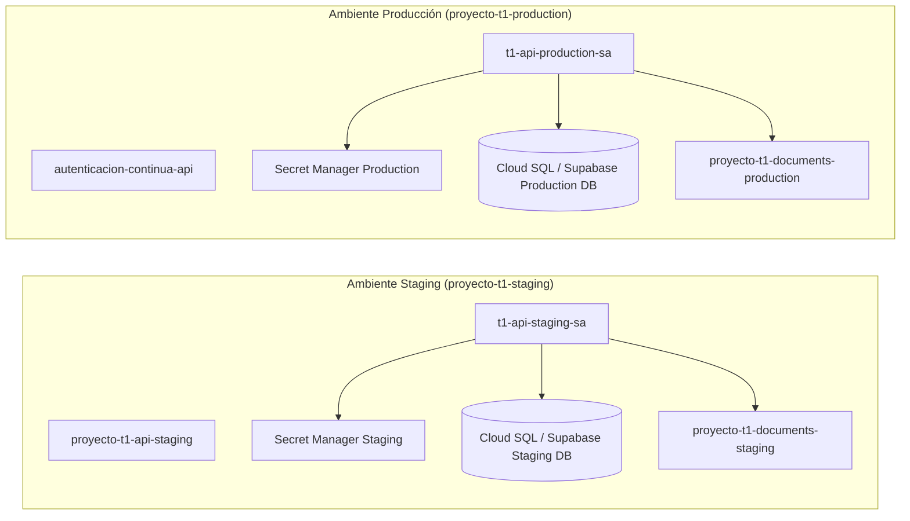

# 02 — Arquitectura y Separación de Ambientes

## Diagrama de Separación de Ambientes (Mermaid)

## Reglas de Aislamiento
1. **Bases de Datos:** Staging y Producción NUNCA comparten la misma instancia o esquema de base de datos.
2. **Secretos:** Las claves de encriptación y tokens de Staging son distintos e independientes de Producción.
3. **Storage Buckets:** Buckets aislados con políticas IAM independientes.
