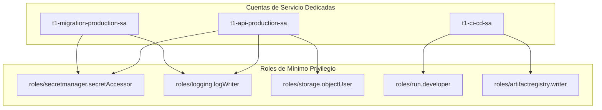

# 04 — Gestión IAM y Mínimo Privilegio

## Cuentas de Servicio y Roles Asignados

## Políticas de Mínimo Privilegio
* Ninguna cuenta de servicio de ejecución runtime posee permisos `roles/owner` o `roles/editor`.
* El acceso a Secret Manager está restringido únicamente a las versiones de secretos consumidas por la aplicación.
