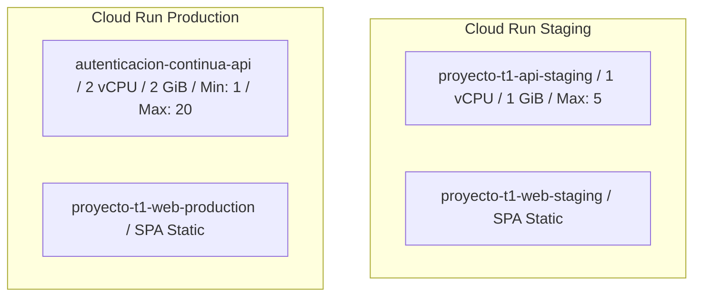

# 06 — Configuración de Contenedores Cloud Run

## Especificación Técnica de Servicios

## Configuración Producción (`autenticacion-continua-api`)
* **Región:** `southamerica-west1`
* **CPU / RAM:** 2 vCPU / 2 GiB RAM
* **Min Instances:** 1 (Instancia tibia para evitar latencia de cold start)
* **Max Instances:** 20 (Límite presupuestario estricto)
* **Concurrencia:** 80 peticiones simultáneas por instancia
* **Puerto:** 8080
