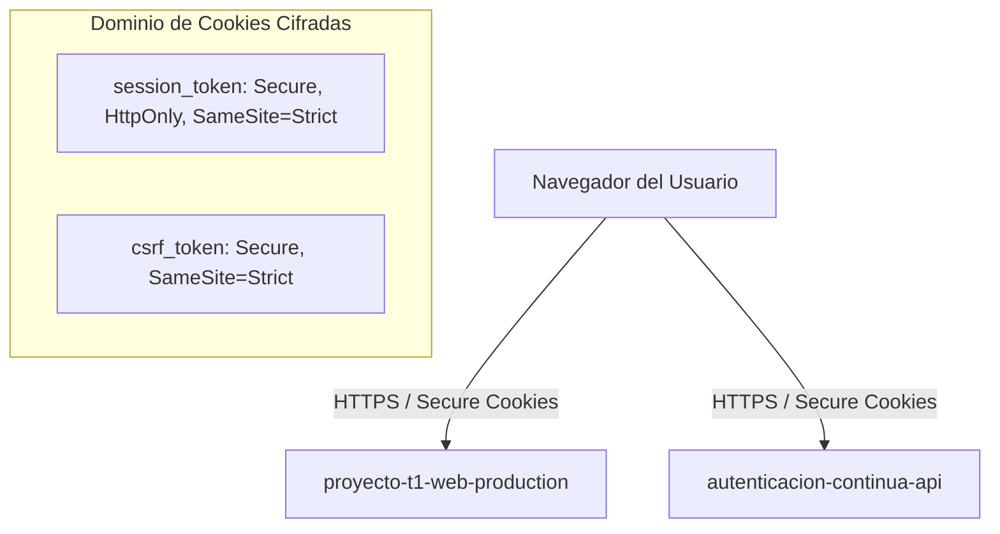

# 09 — Redes, Certificados y Dominio de Cookies

## Mapeo de Dominios y Cookies HTTP-Only

## Compatibilidad de Cookies
* **`COOKIE_SECURE=true`**: Exigido en `production` y `staging` para requerir canal seguro HTTPS.
* **`SESSION_COOKIE_SAMESITE="strict"`**: Previene ataques CSRF inter-sitio.
