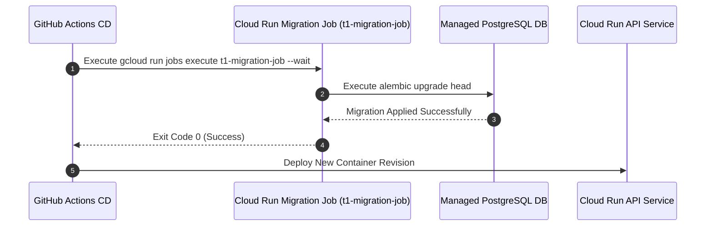

# 11 — Flujo Operativo de Migraciones (Cloud Run Jobs)

## Arquitectura de Ejecución de Migraciones

## Garantías del Proceso
* Evita ejecuciones concurrentes de `alembic` en instancias web escaladas.
* Permite rollback de código sin corrupción de esquema mediante la estrategia *Expand-and-Contract*.
