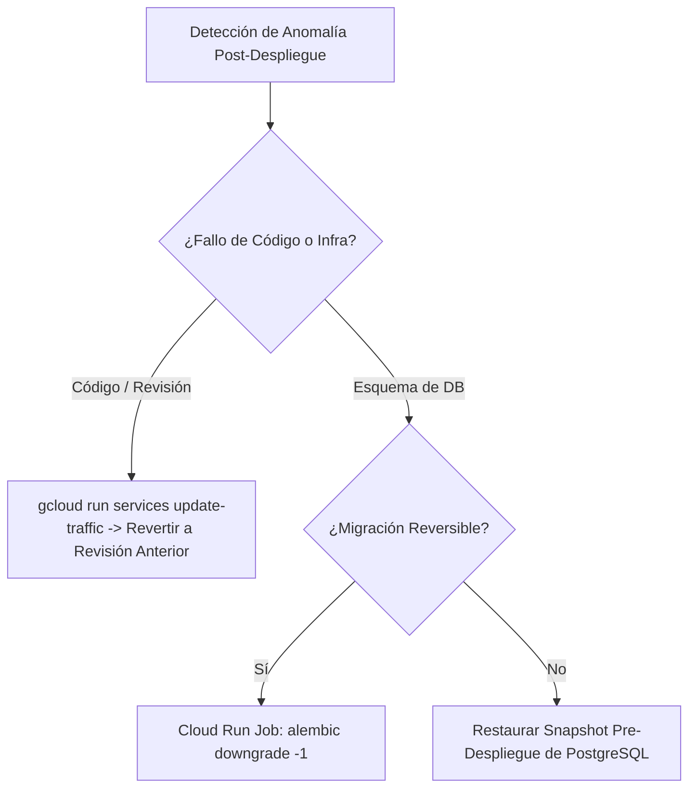

# 14 — Runbook de Rollback de Infraestructura

## Diagrama de Rollback (Mermaid)



## Comandos Operativos
```bash
# Inmediata reversión de tráfico al 100% hacia la revisión anterior en producción
gcloud run services update-traffic autenticacion-continua-api \
  --to-revisions=autenticacion-continua-api-00028-9nd=100 \
  --region=southamerica-west1
```
