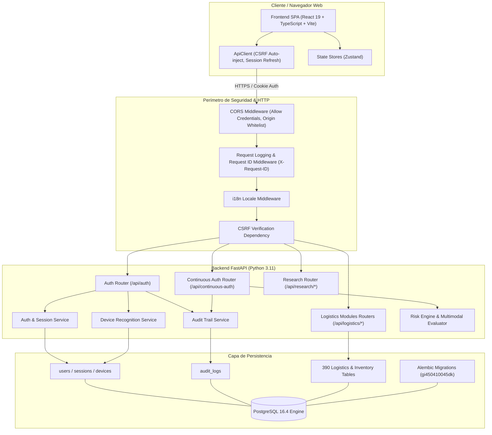
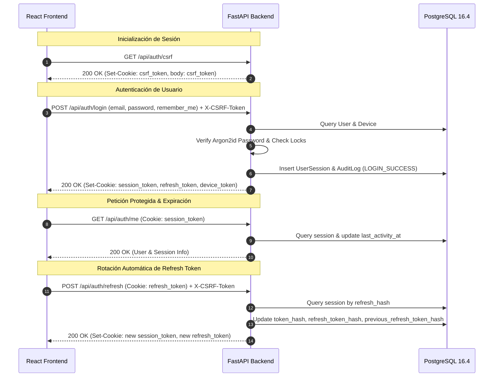

# Arquitectura del Sistema · Fase 001

## 1. Diagrama de Arquitectura Global

```mermaid
flowchart TB
    subgraph Client["Cliente / Navegador Web"]
        FE["Frontend SPA (React 19 + TypeScript + Vite)"]
        AC["ApiClient (CSRF Auto-inject, Session Refresh)"]
        State["State Stores (Zustand)"]
        FE --> AC
        FE --> State
    end

    subgraph Gateway["Perímetro de Seguridad & HTTP"]
        CORS["CORS Middleware (Allow Credentials, Origin Whitelist)"]
        ReqLog["Request Logging & Request ID Middleware (X-Request-ID)"]
        Locale["i18n Locale Middleware"]
        CSRF["CSRF Verification Dependency"]
    end

    subgraph BackendAPI["Backend FastAPI (Python 3.11)"]
        AuthRouter["Auth Router (/api/auth)"]
        ContAuthRouter["Continuous Auth Router (/api/continuous-auth)"]
        LogisticsRouter["Logistics Modules Routers (/api/logistics/*)"]
        ResearchRouter["Research Router (/api/research/*)"]
        
        AuthService["Auth & Session Service"]
        DeviceService["Device Recognition Service"]
        AuditService["Audit Trail Service"]
        RiskEngine["Risk Engine & Multimodal Evaluator"]
    end

    subgraph Persistence["Capa de Persistencia"]
        PG[("PostgreSQL 16.4 Engine")]
        Alembic["Alembic Migrations (gi450410045dk)"]
        UsersTab["users / sessions / devices"]
        AuditTab["audit_logs"]
        LogisticsTab["390 Logistics & Inventory Tables"]
    end

    AC -- "HTTPS / Cookie Auth" --> CORS
    CORS --> ReqLog --> Locale --> CSRF
    CSRF --> AuthRouter & ContAuthRouter & LogisticsRouter & ResearchRouter
    
    AuthRouter --> AuthService & DeviceService & AuditService
    ContAuthRouter --> RiskEngine & AuditService
    
    AuthService --> UsersTab
    DeviceService --> UsersTab
    AuditService --> AuditTab
    LogisticsRouter --> LogisticsTab
    
    UsersTab & AuditTab & LogisticsTab --- PG
    Alembic --- PG
```

---

## 2. Flujo de Autenticación y Rotación de Sesión

```mermaid
sequenceDiagram
    autonumber
    participant UI as React Frontend
    participant API as FastAPI Backend
    participant DB as PostgreSQL 16.4

    Note over UI,API: Inicialización de Sesión
    UI->>API: GET /api/auth/csrf
    API-->>UI: 200 OK (Set-Cookie: csrf_token, body: csrf_token)

    Note over UI,API: Autenticación de Usuario
    UI->>API: POST /api/auth/login (email, password, remember_me) + X-CSRF-Token
    API->>DB: Query User & Device
    API->>API: Verify Argon2id Password & Check Locks
    API->>DB: Insert UserSession & AuditLog (LOGIN_SUCCESS)
    API-->>UI: 200 OK (Set-Cookie: session_token, refresh_token, device_token)

    Note over UI,API: Petición Protegida & Expiración
    UI->>API: GET /api/auth/me (Cookie: session_token)
    API->>DB: Query session & update last_activity_at
    API-->>UI: 200 OK (User & Session Info)

    Note over UI,API: Rotación Automática de Refresh Token
    UI->>API: POST /api/auth/refresh (Cookie: refresh_token) + X-CSRF-Token
    API->>DB: Query session by refresh_hash
    API->>DB: Update token_hash, refresh_token_hash, previous_refresh_token_hash
    API-->>UI: 200 OK (Set-Cookie: new session_token, new refresh_token)
```
