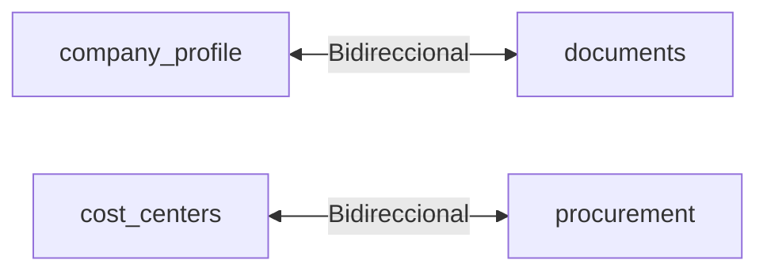
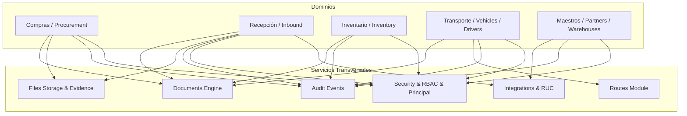

# Matriz de Dependencias y Ciclos · Fase 003

## 1. Matriz de Dependencias entre Submódulos Backend

La siguiente matriz documenta las llamadas e importaciones directas entre submódulos en `backend/app/modules/logistics/`:

| Submódulo Origen | Submódulos Destino Importados | Componentes Compartidos Utilizados | Tipo de Dependencia | Evaluación Arquitectónica |
| :--- | :--- | :--- | :--- | :--- |
| **audit** | *Ninguno* | `models_event.py` | Standalone | VÁLIDA (Zero coupling) |
| **company_profile**| `audit`, `documents` | `auth_dependencies`, `principal` | Domain -> Shared Infrastructure | VÁLIDA (Registra auditoría y artefactos) |
| **cost_centers** | `procurement` | `auth_dependencies`, `principal` | Cross-Domain Persistence | SOSPECHOSA / DEUDA (Importa modelos de requisición para validación de borrado) |
| **documents** | `audit`, `company_profile` | `auth_dependencies`, `principal` | Shared Service -> Domain | SOSPECHOSA / DEUDA (Lifecycle service importa datos de empresa para encabezados) |
| **drivers** | `audit`, `partners` | `auth_dependencies`, `principal` | Domain -> Domain | VÁLIDA (Asociación de conductor a empresa transportista) |
| **files** | `audit` | `auth_dependencies`, `principal` | Standalone Shared Service | VÁLIDA (Gestor binario desacoplado) |
| **gate_control** | `documents`, `drivers`, `inbound` | `auth_dependencies`, `principal` | Domain -> Composite | VÁLIDA (Control de acceso orquesta vehículo, conductor y guía) |
| **inbound** | `audit`, `documents`, `drivers`, `files`, `partners`, `procurement`, `products`, `rbac`, `units`, `vehicle_verifications`, `vehicles` | `auth_dependencies`, `principal` | Composite Domain Orchestration | VÁLIDA (Recepción valida orden, transportista, vehículo y balanza) |
| **integrations** | *Ninguno* | `dependencies` | External Gateway | VÁLIDA |
| **inventory** | `documents`, `inbound`, `units` | `auth_dependencies`, `principal`, `security` | Domain -> Domain & Shared | VÁLIDA (Ingreso a stock desde recepción y balance por unidades) |
| **organization** | *Ninguno* | `dependencies` | Master Domain | VÁLIDA |
| **partners** | `audit` | `auth_dependencies`, `principal` | Master Domain | VÁLIDA |
| **procurement** | `cost_centers`, `documents`, `files`, `products`, `units` | `auth_dependencies`, `principal` | Domain -> Master & Shared | VÁLIDA (Requisición requiere producto, centro de costo y unidad) |
| **products** | `warehouses` | `auth_dependencies`, `principal` | Domain -> Master | VÁLIDA (Reglas de almacenamiento por categoría de producto) |
| **purchase_orders**| `partners`, `products` | `auth_dependencies`, `principal` | Domain -> Master | VÁLIDA |
| **rbac** | `audit`, `security` | `auth_dependencies`, `principal` | Security Domain | VÁLIDA |
| **routes_module** | *Ninguno* | `dependencies` | Standalone Shared Service | VÁLIDA |
| **ruc** | `audit`, `partners` | `auth_dependencies`, `principal` | Integration Domain | VÁLIDA |
| **security** | *Ninguno* | `auth_dependencies`, `principal` | Security Engine | VÁLIDA |
| **shared** | *Ninguno* | *Ninguno* | Primitive Library | VÁLIDA |
| **units** | `products` | `auth_dependencies`, `principal` | Master Domain | VÁLIDA |
| **vehicle_verifications**| `audit`, `vehicles` | `auth_dependencies`, `principal` | Domain -> Domain | VÁLIDA |
| **vehicles** | `audit`, `partners`, `units` | `auth_dependencies`, `principal` | Domain -> Master | VÁLIDA |
| **warehouses** | `audit`, `documents` | `auth_dependencies`, `principal` | Master -> Shared | VÁLIDA (Generación de etiquetas QR y documentos de ubicación) |

---

## 2. Análisis de Ciclos de Dependencia (AST Cycle Analysis)

El análisis estático del árbol de importaciones detectó **2 ciclos bidireccionales**:

### Detalle de los Ciclos:

1. **`company_profile` ↔ `documents`:**
   - `company_profile/asset_service.py` importa `DocumentArtifactStorage` desde `documents.infrastructure.storage`.
   - `documents/application/lifecycle_service.py` importa `CompanyProfileModel` desde `company_profile.models` para estampar la razón social en los documentos renderizados.
   - **Diagnóstico:** Acoplamiento bidireccional leve resuelto mediante imports diferidos a nivel de función (`lazy import`). No genera fallos en tiempo de ejecución ni bloqueos de carga.
   - **Clasificación:** `P3 - Deuda Arquitectónica`.

2. **`cost_centers` ↔ `procurement`:**
   - `procurement/requisitions/application/services/requisition_service.py` importa `CostCenterModel` para verificar que el centro de costo exista antes de crear una requisición.
   - `cost_centers/service.py` importa `PurchaseRequisitionModel` para validar que no existan requisiciones activas antes de permitir la eliminación de un centro de costos.
   - **Diagnóstico:** Dependencia cruzada de integridad referencial.
   - **Clasificación:** `P3 - Deuda Arquitectónica`.

---

## 3. Dependencia de Componentes Transversales

