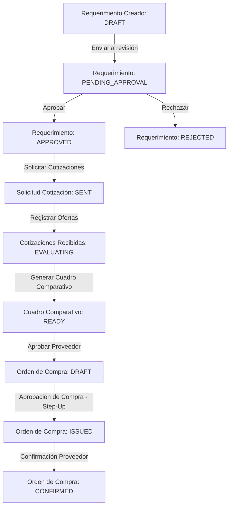
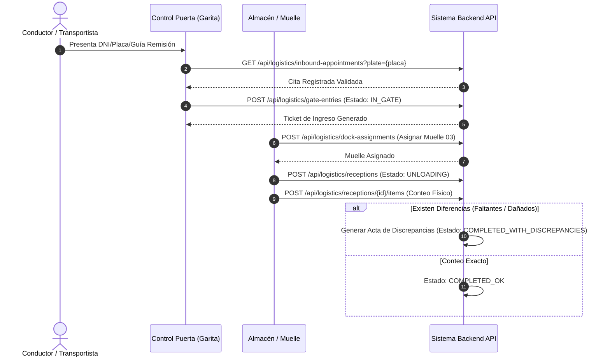
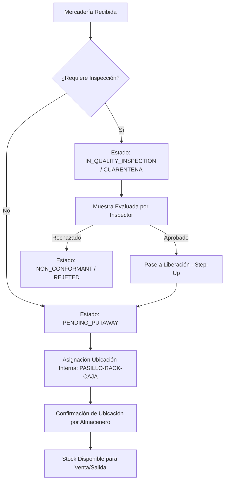
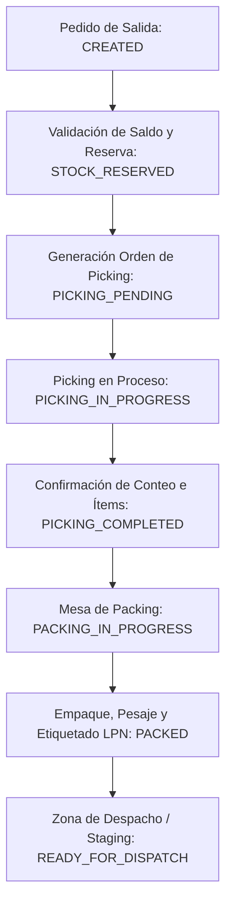
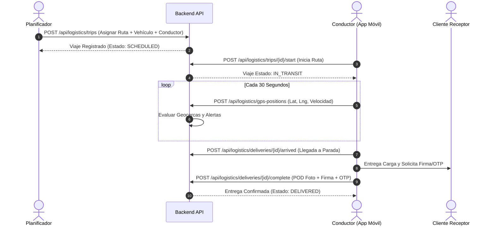
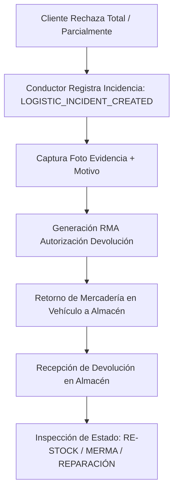
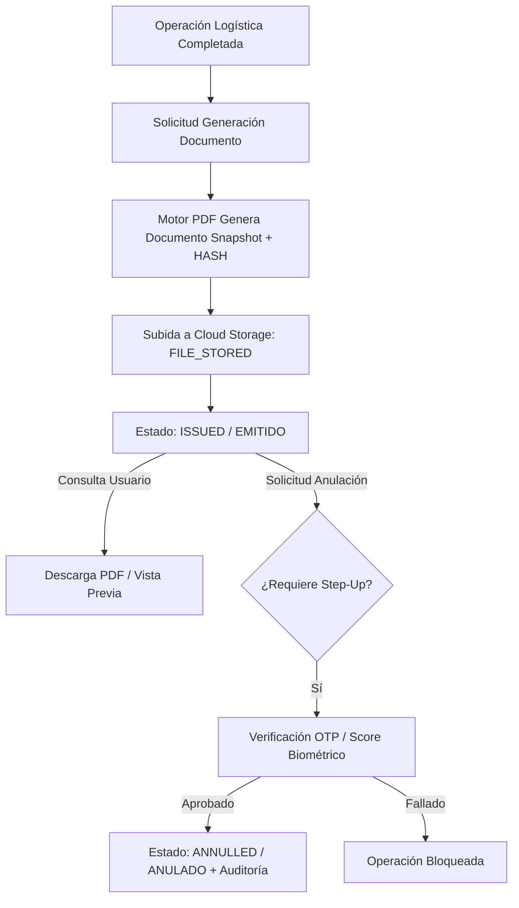

# 04. Flujos Operativos y Diagramas de Estado — Proyecto T1

## Flujo 1: Compras y Abastecimiento

Requerimiento de compra → cotización → evaluación → aprobación → orden de compra.

### Reglas de Negocio
- Compras mayores a $5,000 USD requieren aprobación por Gerencia de Operaciones y Step-up OTP del aprobador.
- La Orden de Compra emitida es **irreversible** y bloquea la modificación de precios.

---

## Flujo 2: Ingreso a Planta y Control de Garita

Aviso de llegada → control de puerta → asignación de muelle → descarga → recepción → diferencias.

---

## Flujo 3: Control de Calidad y Ubicación en Almacén

Recepción → control de calidad → cuarentena → liberación → ubicación → stock disponible.

---

## Flujo 4: Salida de Almacén, Picking y Packing

Pedido de salida → reserva → picking → packing → orden de salida → despacho.

---

## Flujo 5: Transporte, Ruta Real y Seguimiento GPS

Despacho → planificación de ruta → asignación de vehículo → viaje → GPS → entrega.

---

## Flujo 6: Incidencias, Rechazos y Devoluciones

Entrega parcial o rechazo → incidencia → devolución → inspección → disposición.

---

## Flujo 7: Ciclo de Vida Documental

Operación logística → generación documental → emisión → descarga → reimpresión o anulación.

